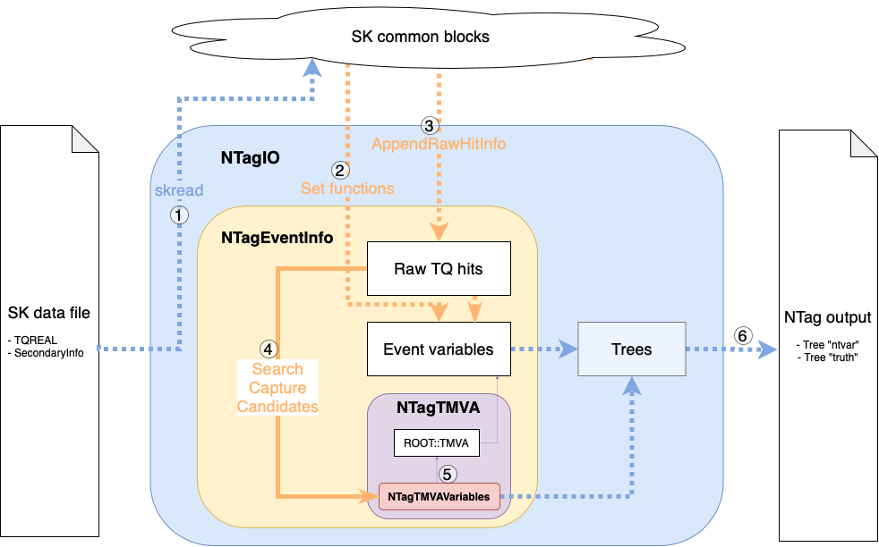

# NTag

NTag is a C++-based program to search for neutron capture candidates in SK data/MC events and tag with multivariate analysis (MVA) tool provided by CERN's ROOT. Any SK data/MC file can be fed to NTag to get an output root file that comes with the `ntvar` tree filled with relevant variables to the neutron tagging algorithm.

## Structure of the program



All neutron tagging in one event is steered by the mainframe class named `NTagEventInfo`, shown as the orange box in the above figure. This class holds information that can be classified into three main categories: raw TQ hits, event variables, and the TMVA variables which are grouped by a class named `NTagTMVAVariables` and eventually fed into the neural network of the MVA tool. The class `NTagEventInfo` also has a bunch of functions that manipulate the information from the input data to form the aforementioned three categories of information that we need in our search for neutron capture candidates. All manipulation of information and variables are handled by the member functions of `NTagEventInfo`.

`NTagIO`shown as the blue box in the above figure is a subclass of `NTagEventInfo`, and it deals with the I/O of SK data fies. It reads the SK data files with `skread`, and uses the member functions of its base class `NTagEventInfo` to set its member variables, i.e., the raw TQ hits, event variables, and the TMVA variables. At the end of an event, `NTagIO` will fill its trees with the above member variables, and will clear all member variables to move on to the next event and loop again. At the end of the input file (EOF), the data trees will be written to an output file.

In detail, the data flow and the search process in one event progresses as follows:

1. An SK data file with TQREAL filled can be read by `NTagIO` via `skread`, and the SK common blocks will be filled by `NTagIO::ReadFile`, which initiates the event loop. The instructions for each event is given by `NTagIO::ReadMCEvent` in case the event is from an MC, otherwise by `NTagIO::ReadDataEvent` which again splits into either of `NTagIO::ReadSHEEvent` for SHE-triggered events or `NTagIO::ReadAFTEvent` for AFT-triggered events. Each "ReadEvent" functions include a set of "Set" functions from `NTagEventInfo`, so that event variables can be read from the SK common blocks.

2. The "ReadEvent" functions mentioned above also call `NTagEventInfo::AppendRawHitInfo` to append the raw TQ hit information from the common block `sktqz` to the private member vectors of `NTagEventInfo`: `vTISKZ`, `vQISKZ`, and `vCABIZ`. The neutron capture candidates will be searched for within these raw TQ vectors.

3. If the raw TQ vectors are set, `NTagEventInfo::SearchNeutronCaptures` will search for neutron capture candidates, looking for NHits peaks within the ToF-subtracted `vTISKZ`. Each selected peak will be saved as an instance of the class `NTagCandidate`, and `NTagEventInfo::vCandidates` is a STL vector that stores all `NTagCandidate` instances from the event.

4. Via function `NTagCandidate::SetNNVariables` The properties of the found capture candidates will be passed on to the class `NTagTMVAVariables`, which holds the variables to be fed to the neural network.

5. The class `NTagTMVA` will feed variables from `NTagTMVAVariables` to ROOT::TMVA, and the TMVA reader will evaluate the weights and the input variables to find the classifier output. The classifier output is set for each `NTagCandidate` instance.

6. Finally, `NTagIO` will fill its trees with the member variables of `NTagEventInfo`, and clear all variables for the next event. If the file hits the end, the trees will be written to an output file.

For the details of each class, visit this [link](https://www-sk.icrr.u-tokyo.ac.jp/~han/NTag/annotated.html).
(VPN to Kamioka is required.)

## Getting Started

### Dependencies

> SKOFL: `skofl-trunk` (As of Sep 30, 2020: required if you're using SecondaryInfo for SKROOT)
>
> ATMPD: `ATMPD_19b`
>
> ROOT: `v5.28.00h`
>
> TMVA: `v.4.2.0` (At the moment, the default path for TMVA is `/disk02/usr6/han/Apps/TMVA`.)

### How to install
```
git clone https://github.com/seunghophysics/NTag.git
```
```
cd NTag; make
```

### How to install $PATH

| Shell type | Install command       | Uninstall command       |
|------------|-----------------------|-------------------------|
| bash       | `. path/bash set`     | `. path/bash unset`     |
| csh/tcsh   | `source path/csh set` | `source path/csh unset` |

Executing NTag binary becomes path-independent after installing the binary path in $PATH.

To use NTag, just type in, for example,
```
NTag -in (input file)
```
in any directory you're in.

### How to run
```
NTag -in (input filename) -out (output filename)
```

### Command line options

* Argument options

| Option  |           Argument            |                      Example usage              |   Use     |
|:--------|-------------------------------|-------------------------------------------------|-----------|
|-in      | (input filename)              | `NTag -in in.dat`                               | mandatory |
|-out     | (output filename)             | `NTag -in in.dat -out out.root`                 | optional  |
|-weight  | (weight filename)             | `NTag -in in.dat -weight weight.xml`            | optional  |
|-method  | (MVA training method name)    | `NTag -in in.dat -method MLP -weight weight.xml`| optional  |
|-method  | (MVA training method name)    | `NTag -in in*.root -method MLP,BDT,LD -train`   | optional  |
|-macro   | (macro filename)              | `NTag -macro macro.xyz`                         | optional  |
|-vx(y,z) | (custom vertex position) [cm] | `NTag -in in.dat -vx -400 -vy 0 -vz -1200`      | optional  |
|-NHITSTH/MX| (NHits threshold / maximum) | `NTag -in in.dat -NHITSTH 5 -NHITSMX 70`        | optional  |
|-TWIDTH  | (Sliding T window width) [ns] | `NTag -in in.dat -TWIDTH 13`                    | optional  |
|-T0TH/MX | (T0 threshold / maximum) [ns] | `NTag -in in.dat -T0TH 18 -NHITSMX 835`         | optional  |
|-TRBNWIDTH | (PMT deadtime width) [&mus] | `NTag -in in.dat -TRBNWIDTH 6`                  | optional  |
|-PVXRES | (Prompt vertex resolution) [cm] | `NTag -in in.dat -PVXRES 10`                   | optional  |
|-VTXSRCRANGE | (Neut-fit search range) [cm] | `NTag -in in.dat -VTXSRCRANGE 1000`          | optional  |
|-MINGRIDWIDTH | (Neut-fit minimum grid width) [cm] | `NTag -in in.dat -MINGRIDWIDTH 10`    | optional  |
|-sigTQpath | (output from `-readTQ` option) | `NTag -in in.dat -sigTQpath sigtq.root`      | optional  |
|-addSKOPTN | (SK option to add)          | `NTag -in in.dat -addSKOPTN 23,24`              | optional  |
|-removeSKOPTN | (SK option to remove)    | `NTag -in in.dat -removeSKOPTN 25,26`           | optional  |
|-SKOPTN  | (SK option to set)            | `NTag -in in.dat -SKOPTN 25,26,16`              | optional  |
|-SKBADOPT | (SK bad channel option to set)     | `NTag -in in.dat  -SKBADOPT 55`                 | optional  |
|-REFRUNNO | (Reference run for dark-noise, etc.) | `NTag -in in.dat -REFRUNNO 85619`   | optional  |

* Macro rules:

Use `#` as the first character in a line to make the entire line a comment.

Arguments must be space-delimited, for example: `-(option) (argument)`

A macro can be used with command line arguments, for example: `NTag -in input.zbs -macro macro.txt`

Example:
```
# input file
-in somepath/input.zbs

# ouptut file
-out otherpath/output.root

# options
-usetruevertex
```

* Run options

|Option|                      Example usage                                | Description |
|:-----|-------------------------------------------------------------------|-------------|
|-apply|`NTag -in NTagOut.root -apply -method MLP -weight weight.xml`|Apply specific MVA weight/method to an existing NTag output (with ntvar & truth trees) to replace the existing TMVAoutput with given weight/method. |
|-train|`NTag -in NTagOut00\*.root -train` |Train with NTag output from MC (with ntvar & truth trees) to generate weight files. Wildcard `\*` usable. |
|-multiclass|`NTag (...) -train -multiclass`  |Start multiclass (Gd/H/Noise) classification instead of binary.|
|-debug|`NTag (...) -debug` |Show debug messages on output stream.|
|-noMVA|`NTag (...) -noMVA` |Only search for candidates, without applying TMVA to get classifer output. The branch `TMVAOutput` is not generated. |
|-noFit|`NTag (...) -noFit` |Neut-fit is not used and no related variables are saved to save time. `-noMVA` is automatically called. |
|-noBONSAI|`NTag (...) -noBONSAI` |Skip extracting BONSAI-related candidate variables. |
|-noTOF|`NTag (...) -noTOF` |Disable subtracting ToF from raw hit times. This option removes prompt vertex dependency. |
|-readTQ|`NTag (...) -readTQ`  |Extract raw TQ from input file and save to a flat ROOT tree `rawtq`. Applicable to ZBS only. |
|-saveTQ|`NTag (...) -saveTQ`  |Save ToF-subtracted TQ hit vectors used in capture candidate search in a tree `restq`.|
|-forceFlat|`NTag (...) -forceFlat`  |Force flat (MC-like flat event) mode for data files. |
|-usetruevertex|`NTag (...) -usetruevertex` |Use true vector vertex from common `skvect` as a prompt vertex. |
|-usestmuvertex|`NTag (...) -usestmuvertex`  |Use muon stopping position as a prompt vertex. |

## Output tree structure

* TTree `ntvar`

| Branch name      | Size        | NN | Description                                             |
|------------------|-------------|----|---------------------------------------------------------|
| RunNo            | 1           | X  | Run number                                              |
| SubrunNo         | 1           | X  | Subrun number                                           |
| EventNo          | 1           | X  | Event number                                            |
| APNDecays        | 1           | X  | # of decay electrons of sub event type                  |
| APNMuE	       | 1           | X  | # of decay electrons                                    |
| APNRings		   | APNRings    | X  | # of Cherenkov rings                                    |
| APRingPID	       | APNRings    | X  | PID of ring                                             |
| APMom	           | APNRings    | X  | Reconstructed ring momentum                             |
| APMomE	       | APNRings    | X  | Reconstructed ring momentum as e-like                   |
| APMomMu	       | APNRings    | X  | Reconstructed ring momentum as mu-like                  |
| pvx              | 1           | X  | X coordinate of APFit neutrino vertex                   |
| pvy              | 1           | X  | Y coordinate of APFit neutrino vertex                   |
| pvz              | 1           | X  | Z coordinate of APFit neutrino vertex                   |
| EVis	           | 1           | X  | Visible energy (MeV/c)                                  |
| TrgType	       | 1           | X  | Trigger type (0: MC, 1: SHE, 2: SHE+AFT, 3: Non-SHE)    |
| NHITAC	       | 1           | X  | Number of OD hits                                       |
| MaxN200		   | 1           | X  | Max N200 in event                                       |
| MaxN200Time	   | 1           | X  | Time of MaxN200 peak                                    |
| NCandidates	   | 1           | X  | # of capture candidates                                 |
| FirstHitTime_ToF | 1           | X  | Index of first hit in T_ToF                             |
| nvx              | NCandidates | X  | X coordinate of Neut-fit vertex                         |
| nvy              | NCandidates | X  | Y coordinate of Neut-fit vertex                         |
| nvz              | NCandidates | X  | Z coordinate of Neut-fit vertex                         |
| N50              | NCandidates | X  | # of PMT hits in 50 ns                                  |
| ReconCT	       | NCandidates | X  | Reconstructed capture time (ns)                         |
| QSum             | NCandidates | X  | Sum of Q in 10 ns (p.e.)                                |
| TRMS50	       | NCandidates | X  | RMS of PMT hit time in 50 ns with Neut-fit vertex       |
| TSpread          | NCandidates | X  | Spread of PMT hit time (max-min) in TWIDTH              |
| NHits	           | NCandidates | O  | # of PMT hits in NTagEventInfo::TWIDTH (ns)             |
| N200             | NCandidates | O  | # of PMT hits in 200 ns                                 |
| TRMS             | NCandidates | O  | RMS of PMT hit time in TWIDTH                           |
| DWall	           | NCandidates | O  | Distance from prompt vertex to wall (cm)                |
| DWallMeanDir	   | NCandidates | O  | Distance from vertex to wall in mean hit direction (cm) |
| AngleMean 	   | NCandidates | O  | Mean of all possible opening angles (deg)               |
| AngleStdev	   | NCandidates | O  | Standard deviation of all possible opening angles (deg) |
| AngleSkew 	   | NCandidates | O  | Skewness of all possibile opening angles                |
| Beta1            | NCandidates | O  | Beta1 calculated in TWIDTH                              |
| Beta2            | NCandidates | O  | Beta2 calculated in TWIDTH                              |
| Beta3            | NCandidates | O  | Beta3 calculated in TWIDTH                              |
| Beta4            | NCandidates | O  | Beta4 calculated in TWIDTH                              |
| Beta5            | NCandidates | O  | Beta5 calculated in TWIDTH                              |
| prompt_nfit	   | NCandidates | O  | Distance to Neut-fit vertex from prompt vertex          |
| BSenergy	       | NCandidates | X  | BONSAI energy in 50 ns                                  |
| bsvx	           | NCandidates | X  | X coordinate of BONSAI vertex                           |
| bxvy             | NCandidates | X  | Y coordinate of BONSAI vertex                           |
| bsvz             | NCandidates | X  | Z coordinate of BONSAI vertex                           |
| BSwall	       | NCandidates | X  | Distance to wall from BONSAI vertex                     |
| BSgood	       | NCandidates | X  | BONSAI fit goodness paramters                           |
| BSdirks          | NCandidates | X  | BONSAI dir_KS                                           |
| BSpatlik         | NCandidates | X  | BONSAI pattern likelihood                               |
| BSovaq           | NCandidates | X  | BONSAI ovaq                                             |
| prompt_bonsai	   | NCandidates | X  | Distance to BONSAI vertex from prompt vertex            |
| bonsai_nfit	   | NCandidates | X  | Distance to Neut-fit vertex from BONSAI vertex          |
| DoubleCount      | NCandidates | X  | (MC-only) 0: Not double count 1: Double count           |
| CTDiff	       | NCandidates | X  | (MC-only) Diff. between true/recon capture times (ns)   |
| capvx 	       | NCandidates | X  | (MC-only) X of related true capture vertex (cm)         |
| capvy            | NCandidates | X  | (MC-only) Y of related true capture vertex (cm)         |
| capvz            | NCandidates | X  | (MC-only) Z of related true capture vertex (cm)         |
| CaptureType	   | NCandidates | X  | (MC-only) 0: Noise 1: H-capture 2: Gd-capture           |
| TMVAOutput       | NCandidates | X  | TMVA classifier output value                            |

All variables with suffix `_n` are variables calculated using the Neut-fit vertex instead of the prompt vertex.

* TTree `truth`

| Branch name   | Size          | Description                                                   |
|---------------|---------------|---------------------------------------------------------------|
| TrgOffset		| 1             | Trigger offset                                                |
| NTrueCaptures | 1             | # of true neutron captures                                    |
| TrueCT        | NTrueCaptures | True capture time (ns)                                        |
| capvx 	    | NTrueCaptures | True capture vertex (cm)                                      |
| capvy 	    | NTrueCaptures | True capture vertex (cm)                                      |
| capvz 	    | NTrueCaptures | True capture vertex (cm)                                      |
| NGamma        | NTrueCaptures | Gamma multiplicity                                            |
| TotGammaE	    | NTrueCaptures | Total gamma energy emitted (MeV)                              |
| NSavedSec     | 1             | # of secondary particles (neutron & capture related)          |
| secvx         | NSavedSec     | X coordinate of the secondary creation vertex                 |
| secvy         | NSavedSec     | Y coordinate of the secondary creation vertex                 |
| secvz         | NSavedSec     | Z coordinate of the secondary creation vertex                 |
| secpx         | NSavedSec     | X-direction momentum of the secondary creation vertex         |
| secpy         | NSavedSec     | Y-direction momentum of the secondary creation vertex         |
| secpz         | NSavedSec     | Z-direction momentum of the secondary creation vertex         |
| SecMom        | NSavedSec     | Momentum of the secondary particle                            |
| SecPID        | NSavedSec     | Particle code of the secondary particle                       |
| SecT          | NSavedSec     | Generated time of the secondary particle                      |
| ParentPID     | NSavedSec     | Parent particle code of the secondary particle                |
| SecIntID      | NSavedSec     | Interaction code (GEANT3) that produced the secondary         |
| SecDWall	    | NSavedSec     | Distance to capture vertex from wall (cm)                     |
| SecCaptureID  | NSavedSec     | Related true capture ID                                       |
| NVecInNeut    | 1             | # of particle at neutrino interaction                         |
| NeutIntMode   | 1             | Interaction mode of neutrino, see NEUT/nemodsel.F             |
| NeutIntMom    | 1             | Momentum at neutrino interaction (GeV/c)                      |
| NnInNeutVec	| 1             | # of neutron in input vector                                  |
| NeutVecPID    | NVecInNeut    | Particle code at neutrino interaction (PDG code)              |
| NVec          | 1             | # of particle of primary vectors in MC                        |
| vecx          | 1             | X coordinate of primary vector vertex                         |
| vecy          | 1             | X coordinate of primary vector vertex                         |
| vecz          | 1             | X coordinate of primary vector vertex                         |
| VecPID        | NVec          | Primary vector particle code (Geant3 code)                    |
| VecMom        | NVec          | Primary vector momentum                                       |
| vecpx         | NVec          | X-direction momentum of primary vector                        |
| vecpy         | NVec          | Y-direction momentum of primary vector                        |
| vecpz         | NVec          | Z-direction momentum of primary vector                        |

* TTree `restq`

This tree is generated if `-saveTQ` option is passed to the main function.

| Branch name   | Size              | Description                                                   |
|---------------|-------------------|---------------------------------------------------------------|
| T             | # of in-gate hits | ToF-subtracted PMT hit times (ns) sorted in ascending order   |
| Q             | # of in-gate hits | Q (p.e.) of each hit in T                                     |
| I             | # of in-gate hits | PMT cable ID of each hit in T                                 |

## Contact

Seungho Han (ICRR) <han@icrr.u-tokyo.ac.jp>